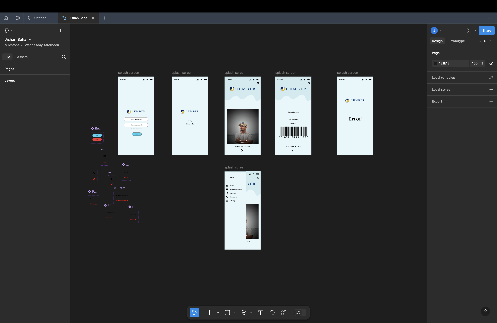

# Files for IXD-5106
## Course: Introduction to Design for Interaction
### Course Code: IXD 5106

### Academic Year: 2024-2026

This course provides foundational knowledge in design tools, methodologies, and best practices essential for web developers, content strategists, UX designers, and creative technologists. Skills introduced here will be built upon in later courses, contributing to the development of each discipline.

## Useful Links
- [Introductory Figma Tutorial on YouTube](https://www.youtube.com/watch?v=ezldKx-jPag)

## Visual Reference

> **Important Notice:** This repository includes my weekly assignments for this course. Developing proficiency in Figma is highly recommended for creating effective, user-centered designs.
